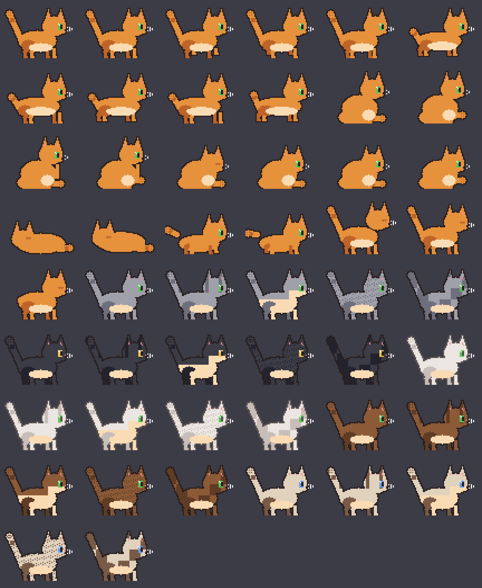

# PlasmaCat — a pixel-art desktop companion cat for KDE Plasma

A cute retro pixel-art cat that lives on your desktop: she walks and jumps on
top of your real application windows, treats them as walls, chases and hunts
your cursor, snuggles with it, sleeps, eats, uses the litter box — and grows
attached to you over time.



## What she does

- **Lives on your desktop and your windows**: jumps onto visible window tops,
  naps there, on wall shelves you place, or in her cat bed. Two visibility
  levels (in front of windows / on the desktop behind them) with a cat door
  animation when she crosses between them.
- **Real cat behavior**: needs (hunger, thirst, energy, play, affection,
  bladder), a pre-sleep ritual, yawn + stretch after naps, kneading, loafing,
  slow-blink "cat kisses", butt wiggles before pounces, tail language by mood,
  zoomies before the litter box, grooming and face washing, startles, and a
  greeting when you come back. Cats are crepuscular — she's most active at
  dawn and dusk.
- **Interacts with your cursor like it's your hand**: petting (strokes),
  head rubs, tail snuggle, hunting and pouncing, paw bats when you tease her,
  and she'll follow you around politely. Neglect her for hours and she eats
  from boredom until she vomits on your desktop (clean it up via the tray).
- **Attachment progression**: from stray to inseparable. High-trust cats
  sleep belly-up and bring you "gifts" (carries the plush mouse to your
  cursor).
- **Customizable**: first-run wizard for name, fur color, pattern (solid,
  tabby, tuxedo, spots, tortie), eyes and collar — recolorable anytime.
- **Stuff to play with**: ball (bouncy physics), plush mouse, string — and a
  **laser pointer**: a red dot follows your cursor; she chases, wiggles and
  pounces but never truly catches it (great for luring her to a spot). Plus
  furniture: scratching post, cat bed, cat grass, litter box (every poop and
  pee shows as its own little pile — you empty it), big cat tree, exercise
  wheel, floating wall shelves, and a cardboard box she hides in to ambush you.
- **Food & water**: food bowl with a little shop (Kibble/Tuna/Milk/Catnip —
  she likes them differently), and a perpetual water fountain that never
  runs dry.
- **Sound**: retro synth pack and a natural pack with real cat recordings —
  meows, purring, eating and drinking (see
  `assets/sounds/natural/ATTRIBUTION.md`), mute + volume in the tray.
- **Status board**: an optional pinned panel painted on the desktop level
  (behind your windows, never in the way, can't get lost) with all need
  bars — toggle and position it from the tray, it remembers its place.
- **Control mode + mini-games**: take the wheel yourself — toggle "Control
  cat" in the tray and steer her with WASD or the arrow keys (jump: Up/W/
  Space, halt: Down/S). First mini-game built on it: **mouse hunt** (60
  seconds, up to 8 scurrying mice — corner them and catch them by touch;
  she also hunts them on her own).

## Requirements

- KDE Plasma 6 on **Wayland** (developed on Fedora 44, Plasma 6.7.3)
- Python 3.10+

## Install & run

```bash
git clone https://github.com/sunsetterphoto/plasmacat.git
cd plasmacat
python3 -m venv .venv
.venv/bin/pip install PySide6-Essentials PySide6-Addons numpy pillow
./run.sh
```

The first run opens the customization wizard. State is saved every 30 s to
`~/.local/share/catgame/save.json` (needs decay while you're away).

Everything is driven from the **system tray icon**: needs status, give treat,
toys, bowls, food shop, furniture, sound, status board, control mode, games,
start at login, customize, reset, quit.

Optional app launcher for your menu (edit the `Exec=` path first):
```bash
sed -i "s|^Exec=.*|Exec=$PWD/run.sh|" plasmacat.desktop
cp plasmacat.desktop ~/.local/share/applications/
```

If the app crashed and left the KWin helper script behind:
```bash
./run.sh --unload-bridge
```

## How it works

- A small transparent, click-through window follows the cat above all windows
  (Wayland apps can't self-position, so the KWin script places it via a rect
  encoded in the window title); one fullscreen layer per screen behind all
  windows holds the furniture. Multi-monitor aware. A tiny persistent KWin
  helper script (`kwin/plasmacat-bridge.js`) streams the cursor position,
  window geometries and the per-screen work areas to the app over DBus.
- The game logic (brain, physics, sprites, sounds) is pure Python and covered
  by a headless simulation test:
  ```bash
  PYTHONPATH=src .venv/bin/python tools/sim_test.py   # must end with SIM_TEST_OK
  ```
- Sprites are generated procedurally in code (`src/plasmacat/cat/sprites.py`),
  so every pose recolors for free. Sounds are numpy-synthesized.

See `PLAN.md` (design) and `DECISIONS.md` (measured facts & trade-offs) for
the architecture.

## License

MIT (see `LICENSE`). Sound recordings in `assets/sounds/natural/` have their
own licenses — see `assets/sounds/natural/ATTRIBUTION.md`.
